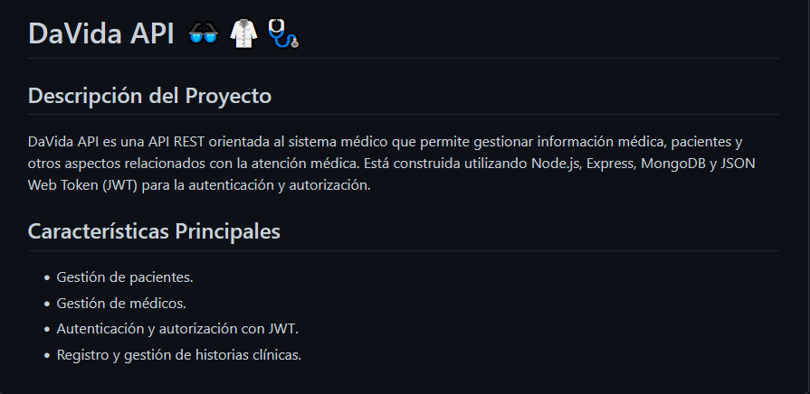
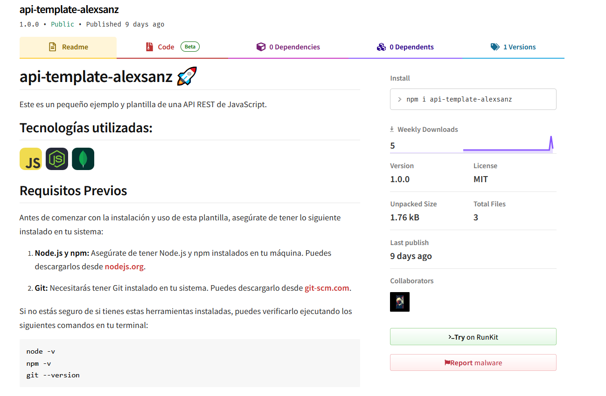

  
  

  

  Desarrollo software desde hace un año y medio, me gusta aprender y mejorar cada día, también gusta trabajar en equipo y aportar mi granito de arena a la comunidad de programación ❤️

  

  # DaVida API
  API REST para la gestión de pacientes y sus datos médicos; medicamentos, médicos, enfermeros, con autenticación y autorización por medio de roles.

  Para más información puedes visitar el repositorio [DaVida API](https://github.com/CodeAlexSanz/DaVidaAPI)

  

  # api-template-alexsanz
  Plantilla para crear una API REST con NodeJS, Express y MongoDB. De esta manera puedes iniciar un proyecto de manera rápida y sencilla sin tener que preocuparte de la configuración inicial.
  
  Para más información puedes visitar el repositorio [api-template-alexsanz](https://github.com/CodeAlexSanz/api-template-alexsanz)

  

  

  

  

  

  [LinkedIn](https://linkedin.com/in/alexanderzelaya/)

  
  
  [Twitter](https://x.com/DevAlexSanz)

  ## Si lo puedes imaginar, lo puedes programar 🚀

